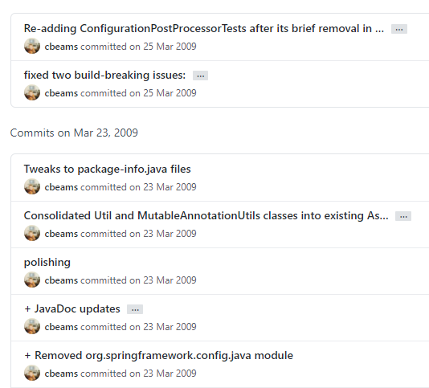
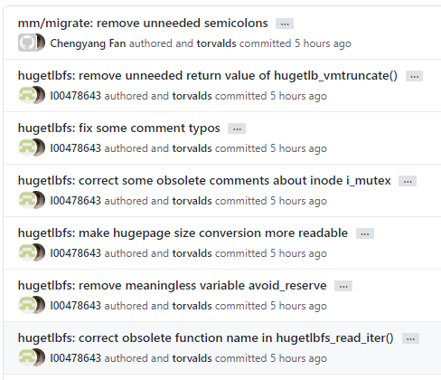
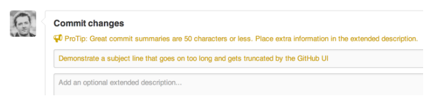
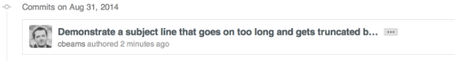

# 커밋 (Commit)
이 가이드는 Chris Beams의 [How to Write Git Commit Message](https://chris.beams.io/posts/git-commit/)의 번역본이며, 내용을 쉽게 전달하기 위해 원본 문서를 편집하였습니다.

{ loading=lazy }

## 왜 좋은 커밋 메세지가 중요한가요?
여러분이 아무 Git 저장소를 열어본다면, 대체적으로 커밋 메세지가 점점 더 적은 정보를 포함하거나 장황해지는 것을 볼 수 있습니다. 예를 들어, 아래 저장소의 커밋 메세지가 그런 경향을 보입니다.



위 저장소의 커밋 메세지와 비교되는, 리누즈 토발즈의 리눅스 커널 저장소의 커밋 메세지는 아래와 같습니다.



어느 쪽이 더 읽기 편한가요?

위쪽은 길이나 구성이 들쭉날쭉한 반면에, 아래쪽은 일정한 규칙을 갖고 있습니다.

잘 작성된 깃 커밋 메세지는 변경점에 대한 문맥을 동료 개발자들에게(혹은 미래의 나 자신에게) 전달하는데 가장 좋은 방법입니다. 토발즈와 같은 개발자는 그 사실을 잘 알고 있습니다. diff 뷰는 **어느** 코드가 변경되었는지는 잘 알려줍니다. 하지만 **왜** 변경되었는지는 깃 커밋 메세지만이 알려줄 수 있습니다.

잘 관리된 깃 로그는 아름답고 유용합니다. git blame, revert, rebase, log, shortlog와 같은 서브 커맨드들이 이제 쓸모있어지기 시작합니다. 다른 사람의 커밋과 풀 리퀘스트를 리뷰하는 것이 훨씬 가치있는 일이 됩니다. 그리고 어느 순간, 이런 일들이 자동으로 되기 시작합니다. 몇 년 전, 혹은 몇 달 전 있었던 일이 왜 있었는지를 이해하는 것이 가능해집니다. 가능해질 뿐만 아니라, 훨씬 효율적이게 됩니다.

프로젝트의 장기적 성공은 유지보수가 용이한지에 따라 크게 좌우됩니다. 유지보수에 사용되는 툴들 중, 프로젝트의 로그보다 더 강력한 것은 거의 없습니다. 로그를 잘 작성하는것을 배우는 것은 시간을 들일 가치가 있는 일입니다. 이는 처음엔 귀찮은 일이겠지만, 곧 습관이 될 것이고, 결과적으로는 관계된 모두에게 자랑이자 생산성의 원천이 될 것입니다.

이 포스트에서는 커밋 히스토리를 작성하는데 가장 기초가 되는 것들을 언급합니다. 개별 커밋 메세지를 어떻게 작성하는가에 대한 것이죠. 여기서는 언급하지 않겠지만, 커밋 합치기와 같은 다른 중요한 개념도 있습니다.

대부분의 언어는 이름, 서식에 대한 그들만의 [잘 정리된 문법 규약](https://style-guide.indentcorp.com)을 가지고 있습니다. – Coding convention, coding standards 라고 합니다. – 물론 여러 다양한 바리에이션이 있으나, 대부분의 개발자들은 그 중 하나를 정해 지키는 것이, 각각의 개발자마다 다양한 규칙을 혼용하는 것 보다 훨씬 낫다는 것에 동의합니다.

팀의 커밋 메세지에 대한 접근법 역시 이와 다를 것이 없습니다. 유용한 히스토리를 만들기 위해서는 팀원들이 커밋 메세지 규약에 동의하고 따라야 합니다. 다행히도 이상적인 깃 커밋 메세지에 대한 이미 잘 만들어진 규약이 있기 때문에 새로 만들 필요는 없습니다. 아래의 일곱 가지 약속만 지킨다면 전문가처럼 커밋을 작성할 수 있을 것입니다.

## 좋은 Git 커밋 메세지를 작성하기 위한 일곱 가지 약속
1. 제목과 내용 사이에는 빈 줄을 하나 넣어 나누기
1. 제목을 최대 50자로 제한하기
1. 제목의 첫 글자는 대문자로 작성하기
1. 제목의 끝에 마침표 넣지 않기
1. 제목은 명령형으로 작성하기
1. 본문은 72자로 끊어서 다음 라인으로 넘기기 - 현재는 강요되는 약속이 아닙니다
1. 본문에 *어떻게* 보다는 *무엇*을 그리고 *왜*에 대한 설명을 넣기

+ 우리는 제목은 영어만으로, 본문은 영어, 한글로 작성하는 것을 허용합니다.

좋은 커밋 메세지의 예는 다음과 같습니다.

```
Summarize changes in around 50 characters or less

More detailed explanatory text, if necessary. Wrap it to about 72
characters or so. In some contexts, the first line is treated as the
subject of the commit and the rest of the text as the body. The
blank line separating the summary from the body is critical (unless
you omit the body entirely); various tools like `log`, `shortlog`
and `rebase` can get confused if you run the two together.

Explain the problem that this commit is solving. Focus on why you
are making this change as opposed to how (the code explains that).
Are there side effects or other unintuitive consequences of this
change? Here's the place to explain them.

Further paragraphs come after blank lines.

 - Bullet points are okay, too

 - Typically a hyphen or asterisk is used for the bullet, preceded
   by a single space, with blank lines in between, but conventions
   vary here

If you use an issue tracker, put references to them at the bottom,
like this:

Resolves: #123
See also: #456, #789
```

### 1. 제목과 내용 사이에는 빈 줄을 하나 넣어 나누기
git commit의 manpage에는 다음과 같은 내용이 있습니다.

> Though not required, it’s a good idea to begin the commit message with a single short (less than 50 character) line summarizing the change, followed by a blank line and then a more thorough description. The text up to the first blank line in a commit message is treated as the commit title, and that title is used throughout Git. For example, Git-format-patch(1) turns a commit into email, and it uses the title on the Subject line and the rest of the commit in the body.

> 필수적인 것은 아니지만, 커밋 메세지를 50자 이내의 짧은 문장으로 시작하는 것은 좋은 생각입니다. 변경점을 요약한 이 짧은 문장 뒤에는 빈 줄을 하나 넣고, 그 뒤에 자세한 설명을 작성합니다. 위의 첫 줄은 Git에서 커밋 제목처럼 취급합니다. 예를 들어, Git-format-patch(1)은 커밋을 이메일로 변경하는데 이때 제목을 위의 첫 줄로 사용하고, 나머지를 내용으로 사용합니다.

모든 커밋이 제목과 본문으로 나뉠 필요가 있는 것은 아닙니다. 어떨때엔 한 줄이면 충분한 경우도 있습니다. 특히 변경점이 단순하고 문맥상 설명이 필요 없는 경우가 이에 해당합니다. 예를 들면 다음과 같습니다.

```
Fix typo in introduction to user guide
```

더이상 무언가 설명할 필요가 없습니다. 만일 팀원이 오타가 무엇이었는지 궁금하다면, 단순히 코드 변경 내용을 보면 됩니다. 이때 git show, git diff 또는 git log -p 명령어가 사용됩니다.

하지만 커밋이 문맥을 설명할만한 가치가 있다면, 본문을 작성하세요. 예시는 다음과 같습니다.

```
Derezz the master control program

MCP turned out to be evil and had become intent on world domination.
This commit throws Tron's disc into MCP (causing its deresolution)
and turns it back into a chess game.
```

다음은 `git log`를 실행했을 때, 이 커밋이 어떻게 보이는지를 나타냅니다.

```bash
$ git log
commit 42e769bdf4894310333942ffc5a15151222a87be
Author: Kevin Flynn <kevin@flynnsarcade.com>
Date:   Fri Jan 01 00:00:00 1982 -0200

 Derezz the master control program

 MCP turned out to be evil and had become intent on world domination.
 This commit throws Tron's disc into MCP (causing its deresolution)
 and turns it back into a chess game.
```

`git shortlog`를 실행하면, 커밋을 개발자 단위로 묶어, 제목만 표시해줍니다.

```bash
$ git shortlog
Kevin Flynn (1):
      Derezz the master control program

Alan Bradley (1):
      Introduce security program "Tron"

Ed Dillinger (3):
      Rename chess program to "MCP"
      Modify chess program
      Upgrade chess program

Walter Gibbs (1):
      Introduce protoype chess program
```

### 2. 제목을 최대 50자로 제한하기
50자의 제한은 반드시 지켜야만 하는 강제사항은 아닙니다. 하지만 가장 중요한 규칙이기도 하죠. 제목을 간결하게 유지하는 것은 제목의 가독성을 늘리고, 커밋 작성자로 하여금 변경 사항을 좀 더 간결하게 작성하도록 고민하게 만듭니다.

> 만일 제목을 50자로 제한하는 것이 힘들게 느껴진다면, 혹은 제목에 and와 같은 접속사가 들어간다면 너무 많은 것을 한번에 커밋하고 있지는 않은지 고민해 보세요. 커밋은 가장 작은 논리적 단위로 작성되어야 합니다. 이런 내용을 다룬 [atomic commits](https://www.freshconsulting.com/insights/blog/atomic-commits/) 라는 좋은 포스트를 추천합니다.

GitHub은 이러한 규칙을 확실히 알고 있습니다. GitHub에서 커밋을 작성할 때, 만일 제목이 50자를 넘어간다면 개발자에게 넌지시 알려줍니다.



그리고 제목이 너무 길다면 72자 이후 부터는 말줄임표와 함께 제목을 잘라서 표시합니다.



### 3. 제목의 첫 글자는 대문자로 작성하기
이것은 매우 간단한 약속입니다. 단순히 모든 제목을 대문자로 시작하면 됩니다. 즉,

- Accelerate to 88 miles per hour

위와 같이 작성하세요.

- accelerate to 88 miles per hour

위와 같이 작성하지 마세요.

### 4. 제목의 끝에 마침표 넣지 않기
제목의 끝에 마침표를 넣는 것은 불필요한 행동입니다. 게다가, 제목을 50자로 제한하는 약속을 따른다면 마침표를 넣기에는 글자수가 너무 소중합니다.

- Open the pod bay doors

위와 같이 작성하세요.

- Open the pod bay doors.

위와 같이 작성하지 마세요.

### 5. 제목은 명령형으로 작성하기
명령형이란 “명령하듯이, 혹은 지시를 내리듯이” 작성하라는 의미입니다. 조금 더 와닿는 의미로는, “동사 원형”으로 시작하라는 말입니다.

우리는 커밋이 이미 일어난 일이기 때문에 과거형으로 작성하기 쉽습니다. 예를 들어, 커밋 메세지를 작성할 때 “메소드에 변수 추가됨“ 이라고 작성하는 것이 “메소드에 변수 추가하라“ 보다 자연스럽게 느껴집니다. 이를 영어로 작성하면 “Added an argument to a method“ 가 “Add an argument to a method“ 보다 자연스럽게 느껴집니다.

명령형으로 작성하는 것이 어떻게 보면 무례하게 받아들여질 수도 있습니다. 이렇게 명령형으로 작성하는 이유들 중 하나는 이미 **Git이 자동으로 커밋 메세지를 작성할 때 명령형을 사용하기 때문**입니다.

예를 들어, git merge 명령이 작성하는 기본 메세지는 다음과 같습니다.

```
Merge branch 'myfeature'
```

git revert 명령을 이용해 커밋을 되돌리면 다음과 같은 커밋이 자동으로 생성됩니다.

```
Revert "Add the thing with the stuff"
This reverts commit cc87791524aedd593cff5a74532befe7ab69ce9d.
```

또는 GitHub에서 풀 리퀘스트를 merge 하면 이런 메세지로 커밋이 생성됩니다.

```
Merge pull request #123 from someuser/somebranch
```

따라서 명령형으로 커밋을 작성하는 것은 Git 자체의 규칙을 따르는 것입니다. 커밋 메세지를 조금 더 예를 들어 보겠습니다.
- Refactor subsystem X for readability
- Update getting started documentation
- Remove deprecated methods
- Release version 1.0.0

이런 방식으로 메세지를 작성하는 것이 처음에는 이상할 수 있습니다. 이미 작성된 내용에 대한 보고의 느낌으로, 혹은 설명문의 느낌으로 커밋 메세지를 작성하기도 합니다. 아래는 잘못된 예시입니다.
- Fixed bug with Y
- Changing behavior of X
- More fixes for broken stuff
- Sweet new API methods

조금 더 이해를 돕기 위해, 우리가 작성하는 커밋 메세지가 다음과 같은 규칙을 지킨다고 생각할 수 있습니다.

**잘 작성된 Git 커밋 제목은 언제나 다음 문장을 완성하도록 구성된다.**

- If applied, this commit will *your subject line here*

올바른 예를 들면 아래와 같습니다.
- If applied, this commit will **refactor subsystem X for readability**
- If applied, this commit will **update getting started documentation**
- If applied, this commit will **remove deprecated methods**
- If applied, this commit will **release version 1.0.0**

> 이 약속은 제목에만 적용된다는 사실을 잊지 마세요.

### 6. 본문은 72자로 끊어서 다음 라인으로 넘기기
> 이 규칙은 이제는 강제되지는 않습니다.

Git은 자동으로 줄바꿈을 해주지 않습니다. 따라서 console 화면에서 커밋 히스토리를 확인할 때 멋진 로그를 확인하려면 수동으로 72자씩 줄바꿈을 해 주어야 합니다.

하지만 우리는 현재 GitKraken 및 Bitbucket 또는 GitHub에서 커밋 메세지를 확인합니다. 이 모든 도구들은 자동 줄바꿈을 지원합니다.

### 7. 본문에 *어떻게* 보다는 *무엇*을 그리고 *왜*에 대한 설명을 넣기
비트코인 코어의 이 커밋이 무엇이 왜 바뀌었는지 설명하는 좋은 예시입니다.

```
commit eb0b56b19017ab5c16c745e6da39c53126924ed6
Author: Pieter Wuille <pieter.wuille@gmail.com>
Date:   Fri Aug 1 22:57:55 2014 +0200

   Simplify serialize.h's exception handling

   Remove the 'state' and 'exceptmask' from serialize.h's stream
   implementations, as well as related methods.

   As exceptmask always included 'failbit', and setstate was always
   called with bits = failbit, all it did was immediately raise an
   exception. Get rid of those variables, and replace the setstate
   with direct exception throwing (which also removes some dead
   code).

   As a result, good() is never reached after a failure (there are
   only 2 calls, one of which is in tests), and can just be replaced
   by !eof().

   fail(), clear(n) and exceptions() are just never called. Delete
   them.
```

만일 이런 내용을 단순히 코드 diff 만으로 판단하려면 얼마나 많은 노력과 시간이 걸렸을지 상상해 보십시오. 이 커밋을 작성한 개발자는 커밋 메세지를 잘 작성하는데 시간을 들인 결과 수많은 동료 개발자와, 앞으로 프로젝트에 기여하게 될 개발자들이 시간을 절약할 수 있게 해 주었습니다.

대부분의 경우, 여러분은 코드가 *어떻게* 변경되었는지에 대한 세부 정보를 남길 수 있습니다. 코드는 일반적으로 스스로 설명하도록(self-explanatory) 작성해야 합니다. 그리고 코드가 너무 복잡하다면, 그때 코드에 설명을 작성합니다. 그게 주석이 필요한 이유입니다.

그러므로 *왜* 이러한 변경을 했는지에 대해 커밋 메세지를 작성하는 것을 최우선으로 생각하세요. 코드를 변경하기 전에는 어떻게 작동했고, 무엇이 잘못 되었으며, 따라서 지금은 어떻게 작동한다. 그리고 문제를 이렇게 해결하기 위하여 왜 이런 결정을 내렸는지 까지 작성하세요.

미래에 합류하게 될 개발자가 당신에게 무한한 감사를 느낄 것입니다. – 혹은 과거의 코드를 수정해야 하는 당신 자신이 될 수도 있고요!
