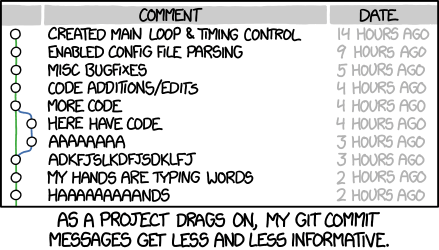

# Commit

## 원자적 커밋 (Atomic Commit)
{ loading=lazy }

1. 제목과 본문을 빈 행으로 분리한다.
1. 제목 행을 50자로 제한한다.
1. 제목 행 첫 글자는 대문자로 쓴다.
1. 제목 행 끝에 마침표를 넣지 않는다.
1. 제목 행에 명령문을 사용한다.

    > If applied, this commit will 'COMMIT-MESSAGE'

1. 본문을 72자 단위로 개행한다.
1. 어떻게 보다는 무엇과 **왜**를 설명한다.

```
$ git log
commit 42e769bdf4894310333942ffc5a15151222a87be
Author: Kevin Flynn <kevin@flynnsarcade.com>
Date:   Fri Jan 01 00:00:00 1982 -0200

 Derezz the master control program

 MCP turned out to be evil and had become intent on world domination.
 This commit throws Tron's disc into MCP (causing its deresolution)
 and turns it back into a chess game.

```

```
$ git log --oneline
42e769 Derezz the master control program
```

```
$ git shortlog
Kevin Flynn (1):
      Derezz the master control program

Alan Bradley (1):
      Introduce security program "Tron"

Ed Dillinger (3):
      Rename chess program to "MCP"
      Modify chess program
      Upgrade chess program

Walter Gibbs (1):
      Introduce protoype chess program

```


## Pull Request
- Pull Request 의 커밋 관리는 `commit --amend` 와 `rebase` 를 적극 활용합니다.
- Pull Request 가 Merge 된 경우, 해당 브랜치를 삭제하도록 합니다.
- 모든 대화가 해결되어야 Pull Request 를 완료할 수 있습니다.
